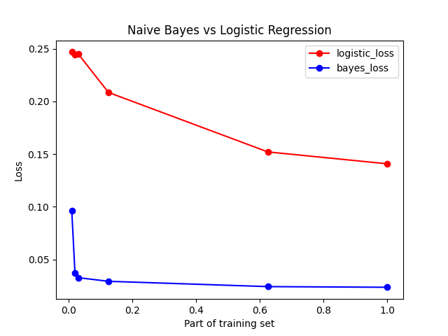

# Logistic Regression vs Naive Bayes Classifier

Comparison of discriminative and generative classifiers on example of 
Logistic Regression and Naive Bayes Classifier. Classifiers were trained 
on this dataset to classify breast cancer as benign or malignant. 

## Training
- Training samples: 2/3 of all samples.
- Test samples: 1/3 of all samples.
- Logistic Regression:
    - activation function: sigmoid
    - alpha parameter: 0.005
    - regularization: L2 with lambda=0.0001
- Naive Bayes Classifier:
    - Laplace smoothing
    -   xj|y=c are treated as variables from multinomial distribution

## Results

Quadratic loss of both classifiers on test samples averaged from 10 trainings. 

## Conclusions

Naive Bayes Classifier achieved to approach its asymptotic error, 
while Logistic Regression didn't as it presumably needs much more training samples for convergence.
According to theoretical results derived 
[here](http://papers.nips.cc/paper/2020-on-discriminative-vs-generative-classifiers-a-comparison-of-logistic-regression-and-naive-bayes.pdf),
asymptotic error of Logistic Regression should
be lower than Naive Bayes one, however I found it quite unlikely given really great 
Naive Bayes performance (97.6% accuracy). Classifying breast cancers may be one example
that it's not always better to be discriminative.
