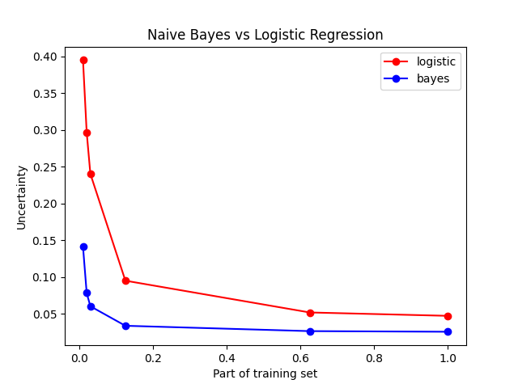

# Logistic Regression vs Naive Bayes Classifier

Comparison of discriminative and generative classifiers on example of 
Logistic Regression and Naive Bayes Classifier. Classifiers were trained 
on this dataset to classify breast cancer as benign or malignant. 

## Training
- Training samples: 2/3 of all samples.
- Test samples: 1/3 of all samples.
- Logistic Regression:
    - data is scaled 
    - activation function: sigmoid
    - theta initialization: uniform [0, 1]
    - alpha parameter: 0.1
    - regularization: L2 with lambda=0.0005
- Naive Bayes Classifier:
    - Laplace smoothing
    -   xj|y=c are treated as variables from multinomial distribution

## Results

Uncertainty and error rate of both classifiers on test samples averaged from 1000 trainings. 

## Conclusions

Naive Bayes Classifier achieved its asymptotic error slightly faster, 
but both classifiers end up with quite the same performance. According to this 
[paper](http://papers.nips.cc/paper/2020-on-discriminative-vs-generative-classifiers-a-comparison-of-logistic-regression-and-naive-bayes.pdf),
asymptotic error of Logistic Regression should be lower than 
Naive Bayes one, thus we can expect Logistic Regression to outperform 
Naive Bayes given more data samples.
